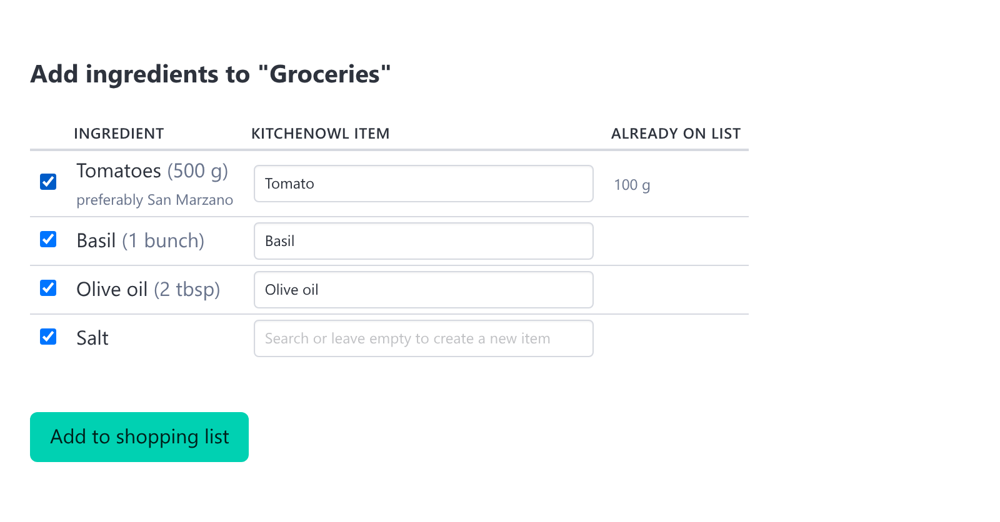
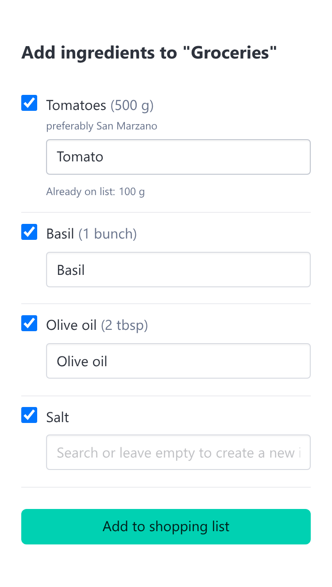
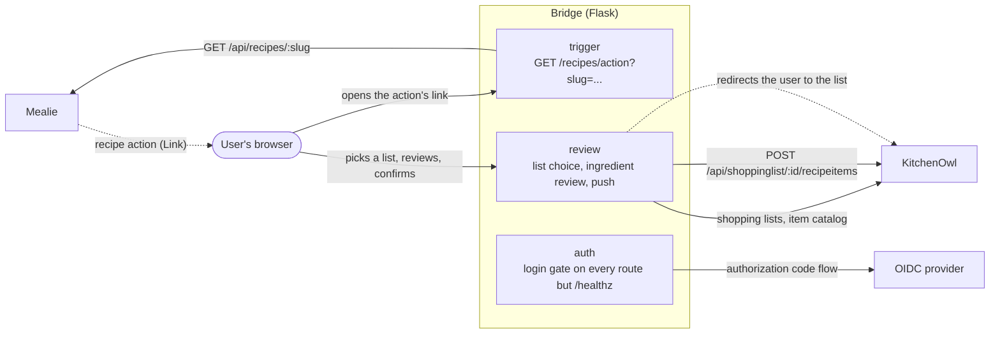

# Mealie ↔ KitchenOwl Bridge

A small Flask web app that connects [Mealie](https://mealie.io/) recipes to
[KitchenOwl](https://kitchenowl.org/) shopping lists: trigger it from a recipe
action in Mealie, review the recipe's ingredients in a web UI, and push the ones
you want onto a KitchenOwl shopping list.

> **Note**: this project is developed largely with AI coding agents and serves as
> a testbed for agentic coding practices (see [AGENTS.md](AGENTS.md)) as much as
> it is a working tool. Review it yourself - its security and data handling in
> particular - before pointing it at real accounts or real data.

## How it works

1. In Mealie, a recipe action of type **Link** opens the bridge with the recipe's
   slug in the URL.
2. The bridge requires an OIDC login, then fetches the recipe from Mealie's API
   and offers the KitchenOwl household's shopping lists to choose from.
3. The ingredient review screen lists the recipe's ingredients, all pre-selected,
   each matched against an existing KitchenOwl item where one looks similar
   enough.
4. Confirming adds the selected ingredients to the chosen list and redirects to
   KitchenOwl.



What the review screen offers:

- **Quantities** from the recipe are shown next to the ingredient and pushed as
  the KitchenOwl item's description. An ingredient without a quantity is pushed
  without a description.
- **Notes** - Mealie's free-text remark on an ingredient ("preferably San
  Marzano") - are shown beneath the name, since they often decide which product
  to buy. They are not pushed to KitchenOwl.
- **Item matching** pre-selects an existing item from the household's catalog.
  Names are lemmatized and compared fuzzily, so "Bananas" matches an existing
  "Banana". The search field next to each ingredient picks a different item;
  clearing it creates a new item instead.
- **Already on list** shows the quantity the matched item currently carries on
  the chosen list, so an ingredient that is already covered is visible before
  pushing. The same marker appears on search suggestions.
- **Unchecking** an ingredient excludes it from the push.
- **Phone layout**: below Bulma's `mobile` breakpoint the review table stacks
  into one block per ingredient - checkbox and name on one line, then the note,
  the item search and the already-on-list hint - so nothing is squeezed into
  columns too narrow to read or hidden behind a sideways scroll. Triggering the
  bridge from a phone in the kitchen is the common case, so this is a supported
  layout rather than a fallback.

  

- **Quantity merging** is KitchenOwl's own: the push uses the same
  `recipeitems` endpoint as KitchenOwl's recipe import, which merges same-unit
  quantities (100 g plus 50 g becomes 150 g) and otherwise appends the new
  quantity to the existing description.

After the push, the bridge redirects to KitchenOwl's `/household/<id>/items`
page. KitchenOwl's frontend has no deep link to a specific shopping list - that
page always opens on whichever list the user last selected there - so it cannot
land on the list just pushed to.

## Architecture



The app holds no state of its own: there is no database, and the ingredients
being reviewed travel between the screens in hidden form fields rather than a
server-side session. KitchenOwl is reached through a single shared household and
API token, independently of which user is logged in.

## Setup

```bash
uv sync
cp .env.example .env  # then fill in real Mealie/KitchenOwl URLs and tokens
uv run playwright install chromium  # needed to run the acceptance (BDD) test suite
```

## Configuration

All configuration is via environment variables (see `.env.example`):

- `KITCHENOWL_URL` / `KITCHENOWL_API_TOKEN` / `KITCHENOWL_HOUSEHOLD_ID` - a single
  shared KitchenOwl household and API token. There is no multi-household or
  per-user KitchenOwl access - everyone who uses the bridge sees and pushes to the
  same household.
- `OIDC_ISSUER` / `OIDC_CLIENT_ID` / `OIDC_CLIENT_SECRET` - required; the app
  refuses to start without them. Every page of the bridge requires signing in
  via this OIDC provider first (see below); `OIDC_ISSUER` is the bare issuer
  URL, and the bridge discovers everything else from
  `{OIDC_ISSUER}/.well-known/openid-configuration`. Register the bridge as a
  confidential client with your provider, with
  `https://bridge.example.com/auth/callback` as an allowed redirect URI.
- `SECRET_KEY` - required; the app refuses to start without it. Signs the login
  session cookie. Keep it stable across restarts (rotating it logs everyone
  out) and generate it with real randomness, e.g.
  `python -c "import secrets; print(secrets.token_hex(32))"`.
- `MEALIE_URL` / `MEALIE_API_TOKEN` - required; the app refuses to start without
  them. Used to fetch the triggering recipe's ingredients server-side by slug
  (`MEALIE_API_TOKEN` is a long-lived API token, generated in Mealie's user
  profile). Mealie's "Post"-type recipe action cannot redirect your browser to
  the bridge - it is executed entirely server-side by Mealie's own backend, so
  any response the bridge returns is invisible to you. Only a "Link"-type
  action causes a real browser navigation, but it cannot carry the recipe's
  data - only whatever is templated into its configured URL - so the bridge
  fetches the triggering recipe from Mealie's own API by slug instead.
  Configure Mealie's recipe action as type **Link**, with URL:
  ```
  https://bridge.example.com/recipes/action?slug=${slug}
  ```
  Mealie substitutes `${slug}` with the current recipe's slug before opening the
  URL in a new tab.

Every route requires an authenticated OIDC session - including that Link action
above and the ingredient review/confirm screens - except `GET /healthz`. OIDC
login only gates the bridge's own UI: KitchenOwl access is still one shared
household/API token (`KITCHENOWL_*` above) regardless of who is logged in - there
is no per-user KitchenOwl access (see AGENTS.md's deferred multi-user decision).
The app is expected to run behind a TLS-terminating reverse proxy that forwards
`X-Forwarded-Proto`/`X-Forwarded-Host`, so the OIDC redirect URI it generates
matches its real public URL.

## Running

```bash
uv run flask --app bridge.app:create_app run
```

`GET /healthz` responds with `{"status": "ok"}`.

## Testing

```bash
uv run pytest
uv run ruff check .
```

Unit and integration tests are plain pytest with no external services. Acceptance
(BDD) scenarios drive a real Chromium browser via Playwright against a real Flask
server - so `uv run playwright install chromium` (see Setup above) is required for
the full suite, not just a subset - accepting the slower runtime in exchange for
exercising real DOM rendering and client-side JS (e.g. htmx) rather than bypassing
them. How the two external services are faked differs:

- **Mealie** is stubbed with `requests_mock` for most scenarios - tests never call
  a live Mealie there.
- The **OIDC provider** is a real identity provider in a container
  (`mock-oauth2-server`, `tests/bdd/oidc_container.py`), like KitchenOwl below, so
  the app's actual Authlib login code runs end to end against a real discovery
  document, token endpoint, and JWKS - with its interactive login page disabled, so
  a browser navigating through it completes the whole authorization-code flow in a
  single hop, with nothing to click.
- **KitchenOwl** scenarios run against a **real KitchenOwl instance in a
  container** instead of a mock, so tests cannot drift from what KitchenOwl actually
  does. This is why the suite needs a working local Docker (or Podman, see below)
  daemon - the KitchenOwl image is pulled and started automatically, no manual
  `docker compose up` needed for tests.

One scenario also runs against a **real Mealie instance in a container** (like
KitchenOwl's), driving an actual browser click through Mealie's own UI - this is
the only way to catch bugs in how Mealie's frontend actually triggers the bridge
(see AGENTS.md), which a direct HTTP call to `/recipes/action` cannot.

### Using Podman instead of Docker

`testcontainers` (via the `docker` Python SDK) also works against a rootless Podman
socket - point `DOCKER_HOST` at it and disable `ryuk` (testcontainers' cleanup
sidecar, which commonly hits privilege issues under rootless Podman):

```bash
systemctl --user start podman.socket  # if not already running
DOCKER_HOST=unix:///run/user/$(id -u)/podman/podman.sock \
  TESTCONTAINERS_RYUK_DISABLED=true \
  uv run pytest
```

Export both variables in your shell profile if you want this to be the default
rather than passing them per invocation.

## Docker

To run the bridge against a real, already-running Mealie/KitchenOwl/OIDC
deployment, point `.env` (see Configuration above) at them and run just the
`bridge` service, skipping the local dev-stack services below with
`--no-deps`:

```bash
docker compose up --build --no-deps bridge
```

Released versions are also published as prebuilt images to
`ghcr.io/languitar/mealie-kitchenowl-bridge`, tagged with the released
version (e.g. `v1.2.3`) and `latest`. Every commit on `main` that passes CI is
additionally published under `dev`, its short commit hash, and the build date
(e.g. `2026-07-29`), for testing unreleased changes.

### Local dev stack

`docker-compose.yml` also defines a full local stack - Mealie, KitchenOwl, and
Authelia (as the bridge's OIDC provider) - so the whole recipe-to-shopping-list
flow can be exercised end-to-end without a real deployment, and without any
setup: every fixed value (TLS/OIDC certificates and keys, client secrets,
session key) is a committed throwaway value, and the only things that cannot
be hardcoded - Mealie/KitchenOwl API tokens and the KitchenOwl household ID,
all minted fresh by each new instance - are generated and wired up
automatically by a `seed` service that runs as part of `up`. One command
brings up a fully working, fully seeded stack:

```bash
docker compose up --build
```

Everything is addressed as `127.0.0.1` rather than `localhost` (Authelia's
cookie-domain validation requires either a dotted domain or an IP address),
and Authelia terminates TLS itself with a self-signed certificate (its
session cookies are always `Secure`, so it cannot run over plain HTTP even
locally) - your browser will show a certificate warning for
`https://127.0.0.1:9091` the first time; click through it.

Open <http://127.0.0.1:9000>, log into Mealie as `changeme@example.com` /
`MyPassword`, open one of the seeded recipes, and use its "Push to
KitchenOwl" recipe action - this is the same Link action a real deployment
would use, already pre-configured by the seed script to point at the local
bridge. Log into the bridge itself with `user` / `pass`
(Authelia's one seeded user, see `docker/authelia/users_database.yml`).
KitchenOwl has a household with a shopping list and a handful of catalog
items already set up, to demonstrate ingredient matching.

Mealie and KitchenOwl are also wired up to authenticate against Authelia
themselves, alongside their own local admin logins - Mealie's login page has
a "Sign in with Authelia" option, and KitchenOwl's has a "Sign in with OIDC"
option, both using the same `user` / `pass` account as the
bridge. Mealie links OIDC logins to existing accounts by email, and
Authelia's `user` account is seeded with the same email as Mealie's local
admin (`changeme@example.com`, see `docker/authelia/users_database.yml`) on
purpose - so "Sign in with Authelia" logs into that same already-seeded
account, recipes and recipe action included. KitchenOwl links OIDC logins by
subject ID instead, which has no local-admin equivalent to match against, so
its "Sign in with OIDC" always provisions a separate account the first time
it is used - the seed script pre-creates that account itself (driving the
OIDC login non-interactively) and adds it to the seeded household, so it
still has the shopping list and catalog items, as a regular member rather
than the household admin.

`scripts/seed_dev_stack.py` (run by the `seed` service) is safe to re-run -
it skips anything it already created and refreshes the tokens it mints,
writing them to a shared volume the `bridge` container sources on startup
(on top of the fixed values in `docker/dev-stack.env`). If you would rather run
the bridge itself with `uv run flask` against the dev stack instead of
`docker compose up --build bridge`, run `cp .env.dev-stack.example .env`
first and re-run `docker compose up --build seed` - it also fills in that
file's blanks. Run it on port 5050 (`uv run flask --app bridge.app:create_app
run --port=5050`), matching the containerized bridge - KitchenOwl's image
hardcodes an internal socket on Flask's default port 5000, which the dev
stack's other containers can otherwise collide with since everything shares
the host's network.

All the secrets in `docker/authelia/`, `docker/dev-stack.env`,
`docker-compose.yml` (Mealie's and KitchenOwl's OIDC client secrets), and
`.env.dev-stack.example` are throwaway values committed on purpose for this
dev-only stack (matching the BDD suite's own test containers, see
AGENTS.md) - never reuse them for a real deployment.

## Code layout & conventions

- `src/` layout, package name `bridge`. Dependencies are managed with
  [uv](https://docs.astral.sh/uv/) and pinned via `uv.lock` - regenerate it with
  `uv lock` after changing dependencies, and commit the updated lockfile.
- Flask blueprints per concern, registered in `src/bridge/app.py`:
  - `routes/trigger.py` - the Mealie recipe-action entry point
  - `routes/review.py` - shopping-list choice, ingredient review, item search,
    and the push to KitchenOwl
  - `routes/auth.py` and `auth.py` - OIDC login and the app-wide login gate
  - `routes/health.py`, `routes/index.py` - health endpoint and home page
- `clients/mealie.py` and `clients/kitchenowl.py` wrap the two HTTP APIs;
  `ingredients.py` turns Mealie's structured ingredient fields into a name,
  quantity and note; `matching.py` does the lemmatized fuzzy matching and the
  search-as-you-type ranking.
- Server-rendered Jinja templates with [Bulma](https://bulma.io/) for styling and
  [htmx](https://htmx.org/) for the item search; both are vendored under
  `src/bridge/static/`.
- UI design follows KitchenOwl's own UI (layout, styling, interaction patterns)
  rather than Mealie's or an independent style, since the bridge's screens are the
  step just before pushing onto a KitchenOwl list and should feel like part of that
  experience.

See [AGENTS.md](AGENTS.md) for how new features get built (the BDD-driven
workflow) and for the reasoning behind decisions deferred so far.

## Commits

Commit messages follow [Conventional Commits](https://www.conventionalcommits.org/):
`<type>: <short, imperative summary>`, e.g. `feat: add fuzzy item matching` or
`fix: handle missing recipe ingredients`. No scopes are used in this repo. Common
types:

- `feat` - new user-facing behavior
- `fix` - a bug fix
- `docs` - documentation only (README, AGENTS.md, comments)
- `test` - test-only changes (no application code)
- `refactor` - code change that doesn't alter behavior
- `build` - build system, dependencies, tooling
- `chore` - everything else (repo housekeeping, CI config, etc.)

Add a body when the *why* isn't obvious from the summary or diff alone - see the
existing `git log` for examples. Keep the summary line short; put details in the
body.

Pull requests are checked against this format with
[commitlint](https://commitlint.js.org/) (`commitlint.config.js`) in CI.

## Releases

Merges to `main` are released automatically with
[semantic-release](https://semantic-release.gitbook.io/) (`.releaserc.json`),
based on the conventional-commit types since the last release: `fix` bumps a
patch version, `feat` bumps a minor version, and a `BREAKING CHANGE:` footer
bumps a major version. A release updates `pyproject.toml` and `uv.lock` and
publishes a GitHub release with generated notes - all pushed back to `main` by
the workflow, so no manual version bumping or tagging is needed.
